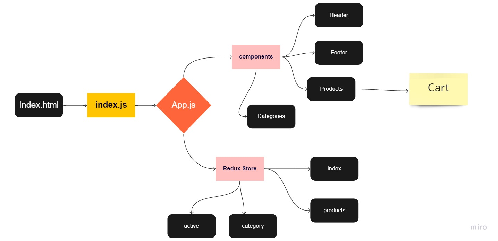

# storefront## Author: Ayah Zaareer
<!--  
## Test CI:
[URL](https://github.com/AyahZaareer/RESTy/actions) -->

## Deploy:
[URI](https://vigorous-elion-967ace.netlify.app/)

## Pull Request:
  - **pull-request#1** :[URL](https://github.com/AyahZaareer/storefront/pull/1)
  - **pull-request#2** :[URL](https://github.com/AyahZaareer/storefront/pull/5)
  - **pull-request#3** :[URL](https://github.com/AyahZaareer/storefront/pull/9)
<!--   - **pull-request#4** :[URL]() --> --> -->

## Setup:
1. clone the repo.
2. create app
3. npm i.

## Run:
 - npm start

## Test:
 - npm test

 
